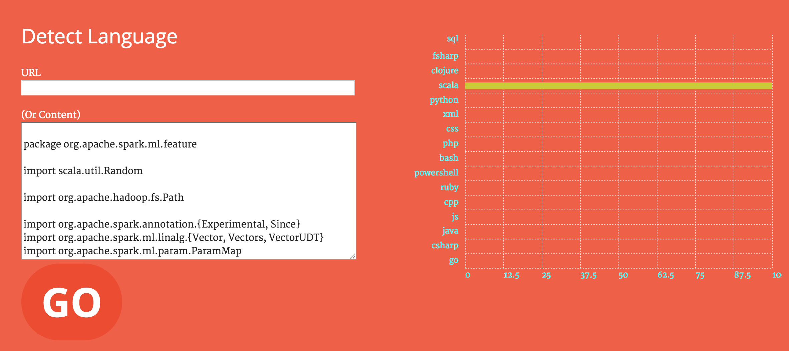

### NOTE!!!
**This repo was taken down by Github and I have managed to salvage it - so here it is but with all stackoverflow snippets (and 64 stars) gone. The issue was, one of the snippets I had harvested from stackoverflow had some sensitive information which was removed from stackoverflow but had stayed in my repo. Obviously removing the offending file from the repo would not do and I had to remove it from all the history. Github actually supplied me with the instructions but sadly they did not work. So I made the original repo private and renamed it and removed all stackoverflow snippets. Have fun!**

# Deep Learning Programming Language Detection
Deep Learning using Keras (and Tensorflow) to detect programming language of **a code file, and in the new version it can recognise snippets with >99% accuracy**. Approach for DL has been based on Zhang and LeCun's 2016 [paper](https://arxiv.org/pdf/1502.01710.pdf) "Text Understanding from Scratch". The main technique is that instead of using word2vec to create word embedding, characters are quantised (turned to one-hot-vector) and then the document is represented by a sequence of quantised characters (vectors). Currently the document is truncated at 2KB and smaller docs are padded by all zero vectors. 

The code from @keon's Github [project](https://github.com/keon/keras-text-classification) was helpful to get started and I used some of the same structures. [I recently realised he has removed the code ever since]

You can download a pre-trained model from [here](https://drive.google.com/file/d/0By4PF7Jis9FzQ2dmeHdPRlFxbWs/view?usp=sharing). This model is trained on GPU over 8 hours.

## Purpose
The project is set up to demonstrate - in simple steps - how to use Keras to build a Deep Learning (DL) model to reconise programming language of a code file or snippet. This can be used to detect language of code snippets and has been trained for it by splitting the files into snippets.  

## Limitations
Small dataset is the main limitation of the project - for a powerful model, you would need at least x10 or x100 samples. Another problem is that the training has been done on full files (and their snippets) and not on snippets. A dataset supplied with snippets (perhaps extracted from StackOverflow) can help. In the end, as we said earlier the project aims to demonstrate the ease of getting started with DL with a relatively small dataset. In the process, it seems to achieve reasonable accuracy that can be improved upon.

## Languages
16 languages were chosen as below:
XML, F#, Clojure, Java, Scala, Python, Javascript, C++, CSS, C#, go, PHP, Ruby, Powershell, bash and SQL

## Data
All the data was extracted from Github using its search feature. Common inert words used for search where the word is not a keyword in a language. The words used are:

> load, dump, write, stream, api, manage, broker, save, process, service
mapping, dispatch, copy, duplicate, sample, chunk, instrument
calculate, append, repository, facade, handler, message, invoke,
controller, locator, customer, view, model, nav, show, new, old, legacy

Data are separated into training (~2000 per language) and test (~1000 per language). In the new version, in order to train for snippets, larger files are broken down and the second and last third of the file are used in the training data. 

There are around **20K snippets extracted from Stackoverflow questions/answers** which due to poor labelling not used for training or testing but can be used to test the system on small or atypical snippets.

## Run the code
You need Keras (and TensorFlow). The code is in python 2.7.

### Training

To train, simply run the `train.py` script:

```python
python train.py
```

If you have GPU enabled, it will automatically use it.

### Testing in batch mode

```python
python test_run.py
```

This tests all files in the test folder and output looks like below:

```
Final result: 7949/8016 (0.991641716567)
xml - Precision:0.996 Recall: 0.994011976048
fsharp - Precision:0.988118811881 Recall: 0.996007984032
clojure - Precision:0.995991983968 Recall: 0.992015968064
java - Precision:0.990118577075 Recall: 1.0
scala - Precision:0.99001996008 Recall: 0.99001996008
python - Precision:0.976470588235 Recall: 0.994011976048
sql - Precision:0.995918367347 Recall: 0.974051896208
js - Precision:0.993951612903 Recall: 0.984031936128
cpp - Precision:0.993975903614 Recall: 0.988023952096
css - Precision:0.994011976048 Recall: 0.994011976048
csharp - Precision:0.986193293886 Recall: 0.998003992016
go - Precision:0.997995991984 Recall: 0.994011976048
php - Precision:1.0 Recall: 0.996007984032
ruby - Precision:0.99595959596 Recall: 0.984031936128
powershell - Precision:0.994023904382 Recall: 0.996007984032
bash - Precision:0.994 Recall: 0.992015968064
xml:    498/501 (0.994011976048)
fsharp:   499/501 (0.996007984032)
clojure:    497/501 (0.992015968064)
java:   501/501 (1.0)
scala:    496/501 (0.99001996008)
python:   498/501 (0.994011976048)
sql:    488/501 (0.974051896208)
js:   493/501 (0.984031936128)
cpp:    495/501 (0.988023952096)
css:    498/501 (0.994011976048)
csharp:   500/501 (0.998003992016)
go:   498/501 (0.994011976048)
php:    499/501 (0.996007984032)
ruby:   493/501 (0.984031936128)
powershell:   499/501 (0.996007984032)
bash:   497/501 (0.992015968064)
```


### Testing a single file

```python
python test.py mytestfile.something
```

This will print the result with likelihood for each 

``` buildoutcfg
1/1 [==============================] - 0s
[[  1.01206303e-02   2.55753571e-06   1.85673562e-05   8.22590722e-04
    1.82982374e-04   5.92526863e-04   2.45171529e-03   3.59758809e-02
    3.59477235e-05   9.33431264e-04   1.38449148e-04   5.55862606e-01
    3.90967846e-01   5.18163608e-04   1.36034854e-03   1.56738879e-05]]
  - go:     		1.0%
  - csharp:     	0.0%
  - java:     		0.0%
  - js:     		0.0%
  - cpp:     		0.0%
  - ruby:     		0.0%
  - powershell:         0.0%
  - bash:     		4.0%
  - php:     		0.0%
  - css:     		0.0%
  - xml:     		0.0%
* - python:     	56.0%
  - scala:     		39.0%
  - clojure:     	0.0%
  - fsharp:     	0.0%
```

## Interactive UI

To run the interactive UI, run the wsgi.py file:

```python
python wsgi.py
```

And you should see application exposed ar port 5000. Browse to [http://127.0.0.1:5000](http://127.0.0.1:5000) and you should see the UI page. Scroll down and either enter a URL or content of a file. Beware, the model is not trained on code snippets so recognition is much poorer on snippets (unless you gather samples and train yourselves).



[Picture is taken from [Kirill Eremenko's Kickstarter](https://www.kickstarter.com/projects/kirilleremenko/deep-learning-a-ztm-online-course) page. Hence his kickstarte is featured on the UI. There is no affiliation and none of the course material was used.].

## Results

System currently achieves **99.16% accuracy** on test data (not seen).

## Docker and Kubernetes
The project contains a Dockerfile and Kubernetes yaml file that you may use to build a simple python service that can score the samples using the UI.
